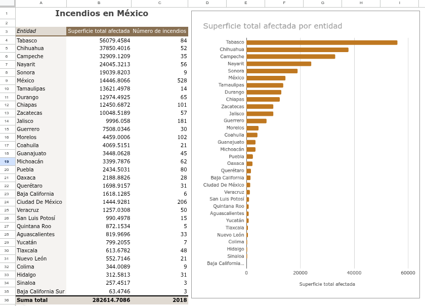
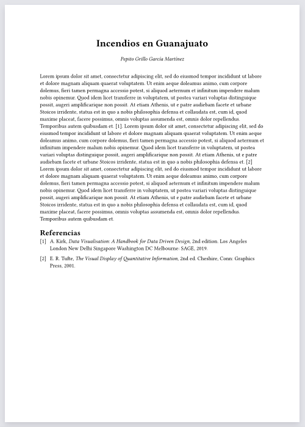

# Práctica 1: Incendios en ANP

En esta práctica debes asesorar a una organización ambientalista que quieren empezar un programa de combate de incendios en las Áreas Naturales Protegidas (ANP). A esta organización le gustaría tener un reporte que hable la situación general de los incendios en las ANPs en México y que detalle la situación en una entidad particular. Te solicitan que investigues los datos del [Monitor de incendios forestales en Áreas Naturales Protegidas](https://monitor_incendios.cnf.gob.mx/incendios_anp) administrada por la Comisión Nacional Forestal (CONAFOR) y la Comisión Nacional de Áreas Naturales Protegidas (CONANP).

Algunas preguntas interesantes que serían útiles a explorar para la organización ambientalista son:

1. ¿Cuál es la entidad con mayor número de incendios?
2. ¿Cuáles son las principales causas de incendios a nivel nacional y/o a nivel de entidades?
3. ¿Cuáles son los tipos de vegetación más afectados a nivel nacional y/o a nivel de entidades?
4. ¿En qué periodos del año hay más incendios?

::: {.callout-note}
# Para saber más

Para saber más sobre las causas y manejo de incendios puedes consultar la [Guía de incendios para comucadores de la CONAFOR](http://www.conafor.gob.mx:8080/documentos/docs/10/236Gu%C3%ADa%20pr%C3%A1ctica%20para%20comunicadores%20-%20Incendios%20Forestales.pdf).
:::

Para esta práctica deberás crear lo siguiente:

1. Una tabla y/o gráfica que resuma alguna variable sobre la situación de los incendios en las entidades de la república
2. Un tablero interactivo que permita explorar gráficas y variables los de incendios para cada entidad. 
3. Un breve reporte que discuta tus resultados.

::: {layout-ncol=3}

:::

## Instrucciones

### Obtener los datos

1. Entra a la página del [Monitor de incendios forestales en Áreas Naturales Protegidas](https://monitor_incendios.cnf.gob.mx/incendios_anp)
2. Selecciona el año 2025 y da click en Filtrar para quedarte solo con los datos del 2025. 
3. Descarga los datos en archivo csv en la tabla que se encuentra hasta abajo de la página.
4. Carga los datos en una hoja de Google sheets

### Entendiendo los datos

Las variables que contiene la base de datos son las siguentes:

- **Semana**: número de semana del año cuando se registró el incendio.
- **Área natural protegida**: nombre del ANP donde se registró el incendio.
- **Categoría**: categoría del ANP.
- **Tipo**: tipo de ANP (federal, estatal, municipal)
- **Estado**: entidad federativa en la cual ocurrió el incendio.
- **Municipio**: municipio en el cual ocurrió el incendio.
- **Posible causa**: posible causa del incendio.
- **Tipo de vegetación**: tipo de vegetación donde ocurrió el incendio.
- **Superficie**: área afectada por el incendio (en ha).
- **Total dias persona**: número de combatientes del incendio (calculado en días/persona, que corresponde a una jornada laboral de 8 horas).
- **Tipo de atención**: tipo de atención que se le dió al incendio (combate o monitoreo).
- **Latitud** y **Longitud**: latitud y longitud del registro del incendio.

### Construye una tabla dinámica

Crea una tabla dinámica que resuma información a nivel de las entidades sobre los incendios. La tabla debe incluir:

1. Una columna donde se resuma la la superficie total afectada por cada entidad.
2. Una columna adicional que resuma información de una variable de tu interés.
3. Opcionalmente puedes crear una gráfica a partir de los datos de tu tabla.

### Construye un tablero interactivo

El dashboard debe cumplir los siguientes requisitos:

1. Tener un desplegable que permita seleccionar una entidad.
2. Un monitor que muestre el número total de incendios que hubo en la entidad seleccionada.
3. Un monitor que muestre el área total afectada en la entidad seleccionada.
4. Una gráfica que muestre el número de incendios que hubo por cada semana del año.
5. Una gráfica de barras que muestre el las principales causas de incendios en la entidad seleccionada.
6. Una gráfica extra que tu elijas que muestre información sobre la entidad seleccionada.

### Escribe un reporte

1. Elige una entidad.
2. Interpreta tus gráficas y escribe un breve reporte describiendo tus principales hallazgos.

El reporte debe cumplir los siguientes requisitos:

- Tener una extensión **máxima de 300 palabras**.
- Incluir:
  - Un título descriptivo
  - Explicar de donde provienen los datos
  - Explicar los principales hallagos (e.g., temporadas con más incendios, principales causas, área total afectada, que posición de área afectada ocupa la entidad con respecto a todas las entidades de la república, etc.)
  - Una reflexión de qué se podría hacer para tener un mejor manejo de los incendios en la entidad que elegiste.

### Entrega

Al Brightspace debes subir:

1. El reporte como un archivo pdf
2. El enlace a tu hoja de cálculo donde estan tus tablas, gráficas y tablero (asegúrate de dar los permisos adecuados para que pueda acceder a tu hoja de cálculo).
