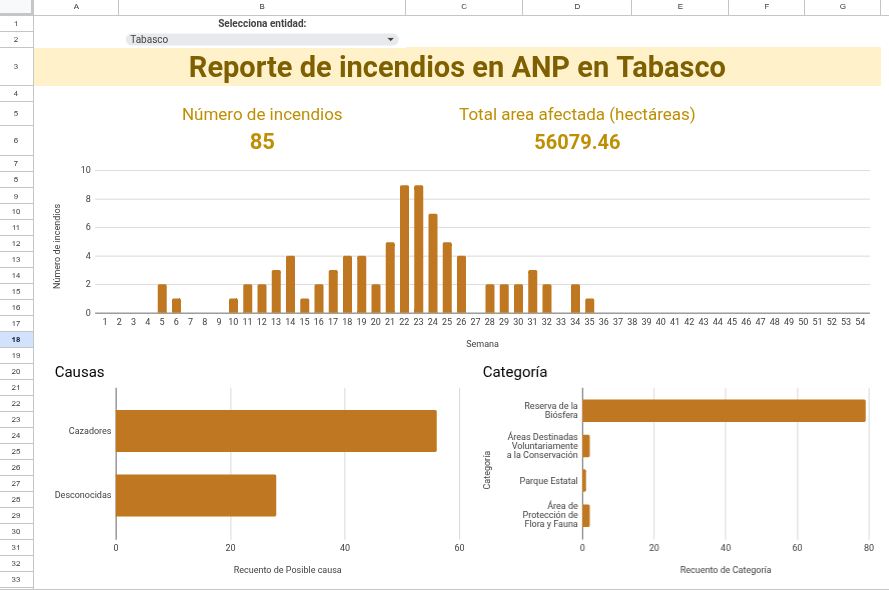

# Práctica 1: Incendios en ANP

En esta práctica explorarás la base de datos del [Monitor de incendios forestales en Áreas Naturales Protegidas](https://monitor_incendios.cnf.gob.mx/incendios_anp) de la Comisión Nacional Forestal (CONAFOR) y la Comisión Nacional de Áreas Naturales Protegidas (CONANP) para el año 2025.

El objetivo de esta práctica es que crees un dashboard interactivo que permita explorar los de incendios para cada entidad. 

## Instrucciones

### Obtener los datos

1. Entra a la página del [Monitor de incendios forestales en Áreas Naturales Protegidas](https://monitor_incendios.cnf.gob.mx/incendios_anp)
2. Selecciona el año 2025 y da click en Filtrar para quedarte solo con los datos del 2025. 
3. Descarga los datos en archivo csv en la tabla que se encuentra hasta abajo de la página.
4. Carga los datos en una hoja de Google sheets

### Entendiendo los datos

Las variables que contiene la base de datos son las siguentes:

- **Semana**: número de semana del año cuando se registró el incendio
- **Área natural protegida**: nombre del ANP donde se registró el incendio
- **Categoría**: categoría del ANP
- **Tipo**: tipo de ANP (federal, estatal, municipal)
- **Estado**: entidad federativa en la cual ocurrió el incendio
- **Municipio**: municipio en el cual ocurrió el incendio
- **Posible causa**: posible causa del incendio
- **Tipo de vegetación**: tipo de vegetación donde ocurrió el incendio
- **Superficie**: área afectada por el incendio (en ha)
- **Total dias persona**: número de combatientes del incendio (calculado en días/persona, que corresponde a una jornada laboral de 8 horas)
- **Tipo de atención**: tipo de atención que se le dió al incendio (combate o monitoreo)
- **Latitud** y **Longitud**: latitud y longitud del registro del incendio

### Construye un dashboard interactivo

El dashboard debe cumplir los siguientes requisitos:

1. Tener un desplegable que permita seleccionar una entidad.
2. Un monitor que muestre el número total de incendios que hubo en la entidad seleccionada.
3. Un monitor que muestre el área total afectada en la entidad seleccionada.
4. Una gráfica de columnas que muestre el número de incendios que hubo en cada semana en la entidad seleccionada.
5. Una gráfica de barras que muestre el las principales causas de incendios en la entidad seleccionada.
6. Una gráfica extra que tu elijas que muestre información sobre la entidad seleccionada.

### Interpeta los datos

1. Elige una entidad.
2. Imprime una captura de tu dashboard.
3. Interpreta tus gráficas y escribe un breve reporte describiendo tus principales hallazgos.

El reporte debe cumplir los siguientes requisitos:

- Tener una extensión máxima de 300 palabras.
- Incluir:
  - Un título descriptivo
  - Explicar de donde provienen los datos
  - Explicar los principales hallagos (e.g., temporadas con más incendios, principales causas, área total afectada)
  - Una reflexión de qué se podría hacer para tener un mejor manejo de los incendios en la entidad que elegiste.

### Entrega

Al Brightspace debes subir:

1. Un solo archivo pdf que incluya la captura de tu dashboard y tu reporte
2. El enlace a tu hoja de cálculo donde esta tu dashboard